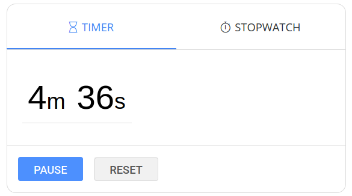
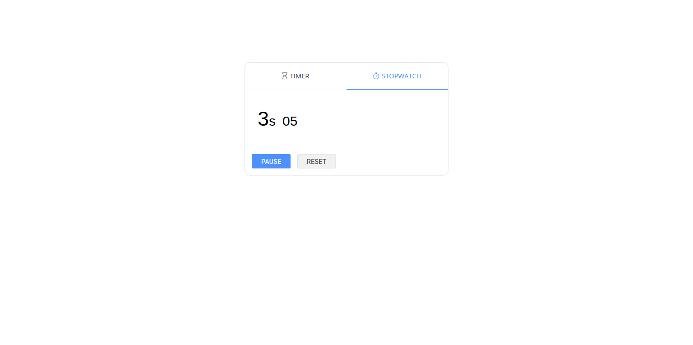

# Timer and Stopwatch
A clone of the google timer and stopwatch. [Click here](https://www.google.com/search?q=timer) to see google timer. 
 
[Link to project demo](https://timer-stopwatch.netlify.app/)
## Overview
This project was built to learn React Hooks.
 
 
The project has 2 tabs:
1. A countdown timer with the a default timer of one minute with the option to pause or reset the timer.
2. A stopwatch with the option to pause or reset.

## Resources used
1. React framerwork was used to build the project.
2. Custom react hooks are used to handle the timer functionality.
3. The UI is styled using custom CSS.

## Project screenshots

### Timer Tab

### Stopwatch Tab

