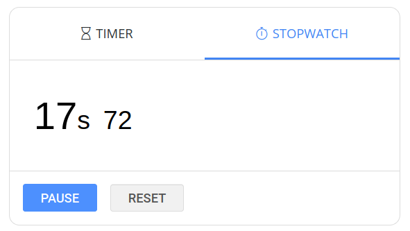

# Timer and Stopwatch
A clone of the google timer and stopwatch. [Click here](https://www.google.com/search?q=timer) to see google timer. 
[Link to project demo](https://timer-stopwatch.netlify.app/)
## Overview
The project has 2 tabs:
1. A countdown timer with the a default timer of one minute with the option to pause or reset the timer.
2. A stopwatch with the option to pause or reset.

## Resources used
1. React framerwork was used to build the project.
2. Javascript is used to manipuplate the grid and update game scores.
3. LocalStorage is used to store previous unfinished game data to load again if the player wants to coontinue with the previous game.

## Project screenshots

### Timer Tab

### Stopwatch Tab

